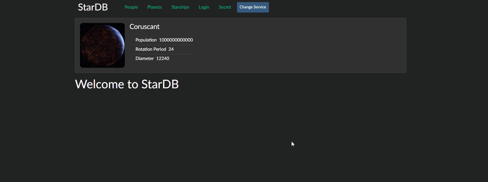

# About this project

This is web application can show some interesting information about the Star Wars in a user friendly formats.

This web application uses two different APIs to get information, and then processes the data to display the correct data.

Also, this application can hide some information for unknown users (simplified version of authentication).

## Demo

## Run Project Locally

1. Clone or fork this repository.
2. Open terminal.
3. In the terminal, go to the location of the downloaded archive.
4. Then write in terminal:
    1. **npm install**
    2. **npm run start**

## Technologies Used

- JavaScript
- Node.js
- Express.js
- ES6 +
- React
- Prop-types
- React Router
- Bootstrap 4
- Adaptive layout
- CSS3
- GIT
